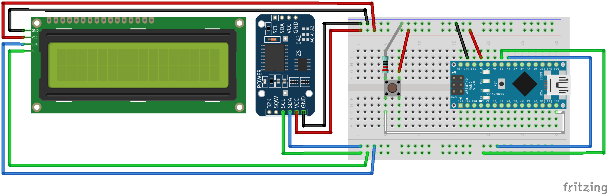

# RTC
This project implements an RTC using DS3231 and LCD1602 (I2C). It can display the current date, DoW (Day-of-Week), time, and temperature. Also, we provide a push-button to toggle the LCD backlight.

### Wiring diagram

# Test Environment
+ Arduino Nano
+ RTC Module: DS3231
+ Display Module: LCD1602 (I2C)

# Package Requirements
+ [DS3231](http://www.rinkydinkelectronics.com/library.php?id=73)
+ [NewLiquidCrystal](https://github.com/fmalpartida/New-LiquidCrystal)

# License
This project is under the [MIT License](./LICENSE).
